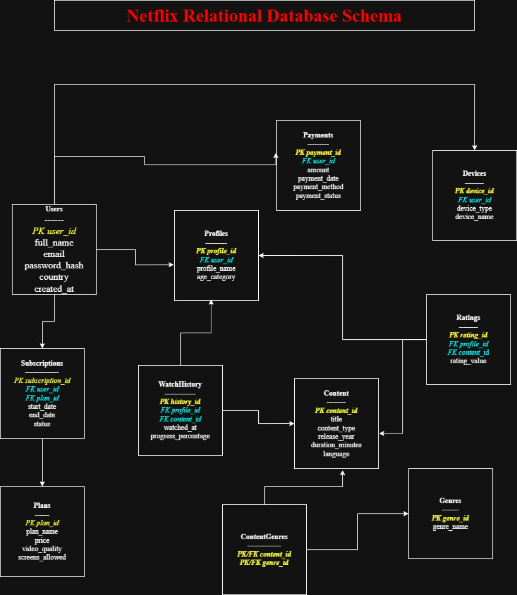

# Netflix Relational Database Schema Design

An academic capstone project modeling a Netflix-style streaming platform with relational database concepts, PostgreSQL SQL definitions, and an entity-relationship diagram.

## Project files

- [PostgreSQL database backup](netflix_schema.sql) — original uploaded database export. Despite the `.sql` filename, this is a PostgreSQL custom-format archive, not a plain-text SQL script.
- [Database schema design report](Netflix_Relational_Database_Schema_Design.docx) — project overview, entity descriptions, relationships, SQL table definitions, sample data, queries, and design rationale.
- [ER diagram](Netflix_ER_Diagram.png) — visual overview of the entities, primary keys, and foreign keys.

## ER diagram

## Database scope

The design covers user accounts, profiles, subscription plans, subscriptions, content, genres, viewing history, ratings, payments, and devices. A `ContentGenres` junction table represents the many-to-many relationship between content and genres. The report also includes a `watchlist` table in its SQL definitions.

## Skills demonstrated

- Relational data modeling and entity relationships
- Primary keys, foreign keys, and composite keys
- Normalization concepts
- PostgreSQL table creation and constraints
- SQL joins and aggregation
- ER diagram design using draw.io

## Explore the project

Open the diagram for an overview, then download the Word report to review the schema and SQL examples. SQL definitions and sample queries are included within the report.

This is an educational model inspired by streaming-platform features; it does not document Netflix's internal production database.
